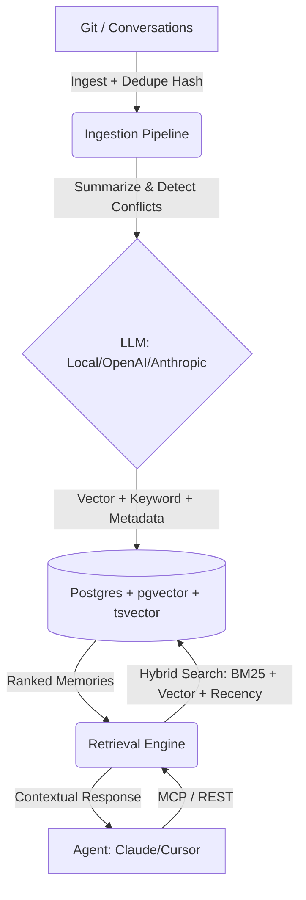

# 🧠 AI Memory Layer


[](https://opensource.org/licenses/MIT)
[](https://fastapi.tiangolo.com/)
[](https://www.postgresql.org/)
[](https://www.python.org/downloads/)

The **AI Memory Layer** is a production-ready "Postgres for AI agent memory." It provides a persistent, semantic, and secure infrastructure that gives any AI coding assistant (Cursor, Claude Code, Copilot) true long-term memory about your project, architecture, and organizational decisions.

---

## 🚀 Enterprise Features (v1.2)
- **🧠 AST-Aware Ingestion:** Uses **Tree-Sitter** to parse code into structural context, capturing function signatures and architectural patterns rather than just text diffs.
- **⚡ HNSW Vector Indexing:** Sub-millisecond vector search at scale using Hierarchical Navigable Small World indexes in `pgvector`.
- **🏎️ Semantic Caching:** Redis-backed caching layer that intelligently stores and retrieves common queries to reduce LLM latency and costs.
- **🔭 Full Observability:** **OpenTelemetry** instrumentation for FastAPI and LLM calls, providing deep tracing into retrieval scores and cost monitoring.
- **🛡️ Memory Consolidation:** A background self-healing process that distills redundant micro-memories into high-level architectural insights.
- **🤖 CI/CD Integration:** Drop-in **GitHub Action** templates for automated project brain synchronization on every push.

---

## 💡 Why AI Memory Layer?
Generic chat logs aren't enough for complex engineering. **AI Memory Layer is purpose-built for high-stakes software development:**

*   **Zero Lock-In:** Run entirely locally using `sentence-transformers` and **Ollama**, or scale with OpenAI/Anthropic.
*   **Architectural Intelligence:** We don't just store chat logs. We ingest Git history, auto-detect conflicts, and extract structured taxonomy (`episodic`, `semantic`, `procedural`).
*   **Enterprise Security:** Built-in Multi-Tenancy (`project_id`) and **X-API-Key authentication**.
*   **True Hybrid Search:** Combines keyword precision with semantic depth, weighted by recency.

---

## 🏗️ Architecture


---

## 🛠️ Quick Start

### 1. Spin up Infrastructure
```bash
docker-compose up -d
```

### 2. Configure Environment
```bash
cp .env.example .env
# Edit .env to set your LLM_PROVIDER and API keys
```

### 3. Install & Run
```bash
python -m venv venv
source venv/bin/activate  # Windows: venv\Scripts\activate
pip install -r requirements.txt

# Start the API server
uvicorn src.main:app --reload
```

---

## 🔌 Agent Integration (MCP)
Give your AI agent a "long-term brain" by connecting it to the Model Context Protocol (MCP) server.

### Cursor / Windsurf
1. Go to **Settings** -> **Models** -> **MCP Servers**.
2. Add a new server:
   - **Type:** `command`
   - **Command:** `python /path/to/ai-memory-layer/src/mcp_server.py`

### Claude Desktop
Add this to your `claude_desktop_config.json`:
```json
{
  "mcpServers": {
    "ai-memory-layer": {
      "command": "python",
      "args": ["/absolute/path/to/ai-memory-layer/src/mcp_server.py"]
    }
  }
}
```

---

## 📦 Python SDK
Integrate the memory layer directly into your Python workflows or CI/CD pipelines.

```python
from sdk import MemoryClient

client = MemoryClient(base_url="http://localhost:8000", api_key="your-secret-key")

# Ingest a repository history
client.ingest(repo_path="./my-project", project_id="my-app", max_commits=100)

# Recall architectural decisions
memories = client.recall("How do we handle auth?", project_id="my-app")
for m in memories:
    print(f"[{m['module']}] {m['content']}")
```

---

## ✨ Core Features
- **Smart Deduplication:** SHA256 content hashing prevents redundant memories.
- **Conflict Detection:** AI automatically flags if a new decision contradicts a previous one.
- **Advanced MCP Tools:** `recall_memory`, `store_memory`, `list_recent_memories`, `flag_contradiction`.
- **Memory Dashboard:** Built-in React UI at `/dashboard` with coverage heatmaps.

---

## 🗺️ Roadmap
- [ ] **GitHub Actions Integration:** Auto-ingest memories on every PR merge.
- [ ] **Multi-User RBAC:** Granular permissions for team-wide memory layers.
- [ ] **Graph-Based Recall:** Linking related decisions across different modules.
- [ ] **Slack/Discord Bot:** Capture decisions directly from team chats.

---

## ❓ Troubleshooting
- **Database Connection Error:** Ensure Docker is running and the port `5433` is not occupied.
- **Embedding Failures:** If using `local`, ensure you have enough RAM for the `sentence-transformers` model.
- **MCP Not Loading:** Ensure you use the absolute path to `mcp_server.py` in your agent configuration.

---

## 🤝 Contributing
Contributions are welcome! See [CONTRIBUTING.md](CONTRIBUTING.md).

## 📄 License
MIT License - see [LICENSE](LICENSE).
