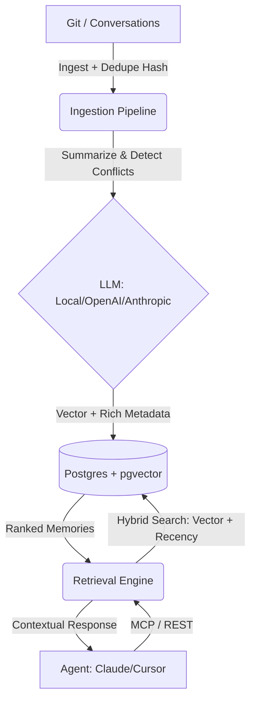

# AI Memory Layer

The **AI Memory Layer** is a production-ready "Postgres for AI agent memory." It is designed to run as a backend service providing secure, multi-tenant, long-term semantic memory to coding agents like Claude Code, Cursor, and Copilot.

## Why AI Memory Layer? (vs. Mem0 / Supermemory)
While tools like Mem0 and Supermemory provide generic graph/vector memory for agents, **AI Memory Layer is purpose-built for enterprise software teams:**
1. **Zero Lock-In:** Run entirely locally using `sentence-transformers` and Ollama, or scale up with OpenAI/Anthropic.
2. **Architectural Understanding:** We don't just store chat logs. We ingest Git history, auto-detect conflicts between old and new decisions, and extract structured taxonomy (`episodic`, `semantic`, `procedural`).
3. **Multi-Tenant & Secure:** Built from Day 1 with Project/User IDs and X-API-Key authentication. No more open vectors.
4. **Hybrid Recency Scoring:** A 2-year-old memory shouldn't override yesterday's decision. We score memories using a hybrid of cosine similarity and exponential recency decay.

## Architecture


## Features
- **Multi-LLM Support:** Toggle between OpenAI, Anthropic, or fully Local (`sentence-transformers`) via `.env`.
- **API Authentication:** Protected REST endpoints requiring `X-API-Key`.
- **Smart Deduplication:** Content hashing (SHA256) prevents duplicate memories when re-ingesting repos.
- **Conflict Detection:** AI automatically flags if a new memory contradicts an existing architectural decision.
- **Memory Dashboard:** A built-in React UI (`/dashboard`) showing memory health, conflicts, and module coverage.
- **Expanded MCP Server:** Agents can `recall_memory`, actively `store_memory`, `list_recent_memories`, and `flag_contradiction`.
- **Python SDK:** Lightweight client for easy integration into your own Python tools.

## Setup Instructions

1. **Start the Database**
   ```bash
   docker-compose up -d
   ```

2. **Install Dependencies**
   ```bash
   python -m venv venv
   source venv/bin/activate  # On Windows: venv\Scripts\activate
   pip install -r requirements.txt
   ```

3. **Configure Environment**
   Copy `.env.example` to `.env` and set your API keys and provider preferences.

## Usage

### 1. The Dashboard
Run the server and visit `http://localhost:8000/dashboard` to see the React-based memory health heatmap.
```bash
uvicorn src.main:app --reload --port 8000
```

### 2. Python SDK
```python
from sdk import MemoryClient

client = MemoryClient(base_url="http://localhost:8000", api_key="my-dev-api-key-123")

# Ingest a repo
client.ingest("/path/to/repo", project_id="acme-backend")

# Ask the AI brain
memories = client.recall("Why did we choose Kafka?", project_id="acme-backend")
for m in memories:
    print(f"Confidence: {m['confidence']} | {m['content']}")
```

### 3. MCP Server (For Cursor/Claude Desktop)
Configure your agent to run:
```bash
python src/mcp_server.py
```

### 4. Running Tests
We use `pytest` for automated testing.
```bash
python -m pytest tests/
```

## Next Steps
- Add GitHub Webhook integration for automatic PR/Issue ingestion.
- Implement graph-based relationship mappings (e.g., Module A depends on Module B).
