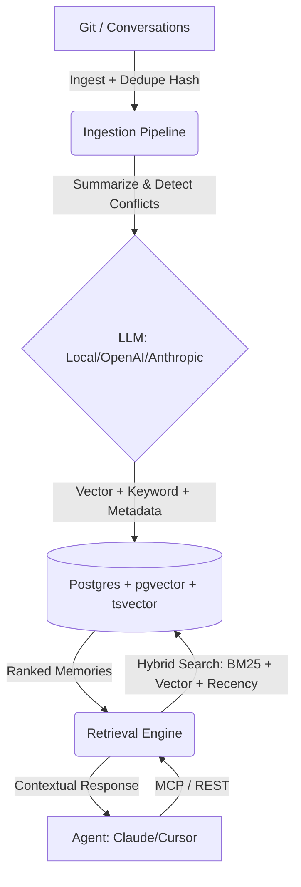

# AI Memory Layer


[](https://opensource.org/licenses/MIT)

The **AI Memory Layer** is a production-ready "Postgres for AI agent memory." It provides a persistent, semantic, and secure infrastructure that gives any AI coding assistant (Cursor, Claude Code, Copilot) true long-term memory about your project and organization.

## Why AI Memory Layer?
While generic memory tools exist, **AI Memory Layer is purpose-built for enterprise software engineering:**
1. **Zero Lock-In:** Run entirely locally using `sentence-transformers` and **Ollama**, or scale with OpenAI/Anthropic.
2. **Architectural Intelligence:** We don't just store chat logs. We ingest Git history, auto-detect conflicts between decisions, and extract structured taxonomy (`episodic`, `semantic`, `procedural`).
3. **Enterprise Security:** Built with Multi-Tenancy (`project_id`) and **X-API-Key authentication** from the start.
4. **True Hybrid Search:** Combines **PostgreSQL Full-Text Search (tsvector)** for keywords with **pgvector** for semantics, ranked by an exponential recency decay.

## Architecture


## Core Features
- **Smart Deduplication:** SHA256 content hashing prevents redundant memories during repo re-ingestion.
- **Conflict Detection:** AI automatically flags if a new decision contradicts a previous one.
- **Advanced MCP Tools:**
    - `recall_memory`: Semantic + Keyword recall.
    - `store_memory`: Manual capture mid-conversation.
    - `list_recent_memories`: Scoped recency audit.
    - `flag_contradiction`: Mark memories as obsolete.
- **Memory Dashboard:** Built-in React UI (`/dashboard`) with module coverage heatmaps.

## Setup & Installation

### 1. Infrastructure (Docker)
We use `ankane/pgvector` for a pre-configured vector database.
```bash
docker-compose up -d
```

### 2. Environment Configuration
Copy `.env.example` to `.env` and configure your providers:
- **`EMBEDDING_PROVIDER`**: `openai` or `local` (uses sentence-transformers).
- **`LLM_PROVIDER`**: `openai`, `anthropic`, or `local` (expects Ollama on localhost:11434).
- **`API_KEY_SECRET`**: Your master key for the memory layer.

### 3. Application Setup
```bash
python -m venv venv
source venv/bin/activate  # Windows: venv\Scripts\activate
pip install -r requirements.txt
```

## Usage

### Ingesting Your First Repository
Use the Python SDK to start building the "brain" of your project:
```python
from sdk import MemoryClient

client = MemoryClient(base_url="http://localhost:8000", api_key="your-secret-key")

# Ingest last 50 commits from a repo
client.ingest("/path/to/project", project_id="my-app", max_commits=50)
```

### Intelligent Recall
```python
# The engine will use hybrid search to find the best match
results = client.recall("How do we handle database migrations?", project_id="my-app")
for m in results:
    print(f"[{m['module']}] Confidence: {m['confidence']}\n{m['content']}")
```

### Agent Integration (MCP)
Point your AI agent (Cursor/Claude Desktop) to:
```bash
python src/mcp_server.py
```

## Testing & Quality
The project maintains 100% PEP 8 compliance and is verified via automated CI.
```bash
# Run the test suite
python -m pytest tests/

# Run the local test harness
python tests/harness.py
```
