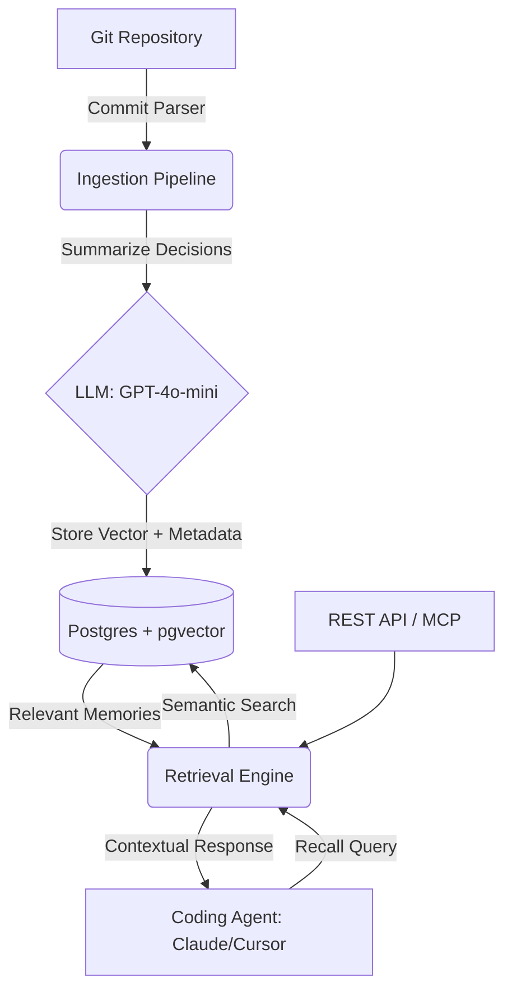

# AI Memory Layer (Phase 1)

This repository contains the MVP implementation of the **AI Memory Layer**, a "Postgres for AI agent memory." It is designed to run as a backend service providing long-term semantic memory to coding agents like Claude Code, Cursor, and Copilot.

## Architecture


- **API Server:** Built with FastAPI (`src/main.py`)
- **Database:** PostgreSQL with `pgvector` for vector embeddings (`src/database.py`, `src/models.py`)
- **Ingestion Pipeline:** Uses `gitpython` and OpenAI's API to extract and summarize architectural decisions from git commits (`src/ingest.py`).
- **Retrieval Engine:** Semantic search via cosine distance using `pgvector` and OpenAI's `text-embedding-3-small` (`src/recall.py`).
- **MCP Server:** Exposes memory retrieval directly as a Model Context Protocol (MCP) tool (`src/mcp_server.py`).

## Core Memory Types
1. **Episodic**: Past bug fixes and decision reasoning from git history.
2. **Semantic**: Module responsibilities and architectural intent.
3. **Procedural**: Team-specific coding standards extracted from diff patterns.
4. **Working**: Real-time context surfaced via MCP during active coding.

## Setup Instructions

1. **Start the Database**
   We use the `ankane/pgvector` image to provide PostgreSQL with the `pgvector` extension pre-installed.
   ```bash
   docker-compose up -d
   ```

2. **Install Dependencies**
   It's recommended to use a virtual environment.
   ```bash
   python -m venv venv
   source venv/bin/activate  # On Windows: venv\Scripts\activate
   pip install -r requirements.txt
   ```

3. **Configure Environment**
   Copy `.env.example` to `.env` and fill in your OpenAI API Key.
   ```bash
   cp .env.example .env
   ```

## Usage

### 1. Test Harness (Quick Start)
Run the built-in test harness to initialize the DB, ingest local git commits, and test semantic recall.
```bash
python tests/harness.py
```

### 2. Start the API Server
Provides `/ingest` and `/recall` endpoints.
```bash
uvicorn src.main:app --reload --port 8000
```
- API Docs: `http://localhost:8000/docs`

### 3. Start the MCP Server
Run the MCP server to directly expose the `recall_memory` tool to compatible clients.
```bash
python src/mcp_server.py
```
*(Configure your agent, e.g., Cursor or Claude Desktop, to point to this script as an MCP stdio server).*

## Next Steps (Phase 2 & Beyond)
- Implement conflict detection between contradictory memories.
- Add graph relationships (e.g. Neo4j/Kuzu) to map dependencies.
- Build the web dashboard for team-wide memory visibility.
