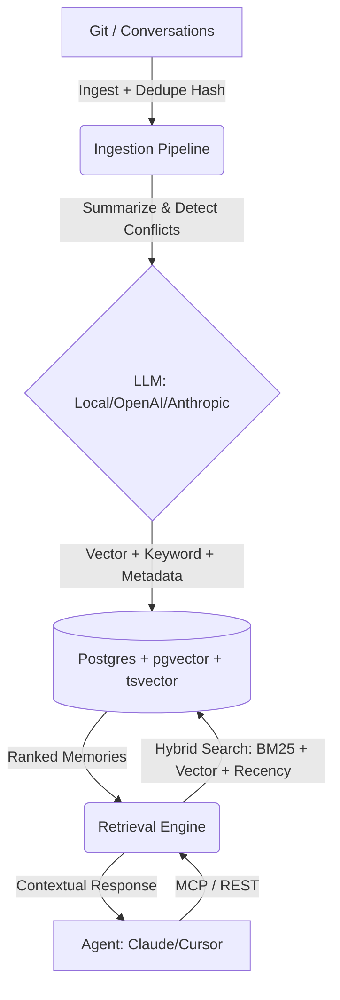

# 🧠 AI Memory Layer


[](https://opensource.org/licenses/MIT)
[](https://fastapi.tiangolo.com/)
[](https://www.postgresql.org/)

The **AI Memory Layer** is a production-ready "Postgres for AI agent memory." It provides a persistent, semantic, and secure infrastructure that gives any AI coding assistant (Cursor, Claude Code, Copilot) true long-term memory about your project, architecture, and organizational decisions.

---

## 🚀 What's New in v1.1
- **Fully Asynchronous Core:** Built on FastAPI with `async/await` throughout the entire stack (LLM calls, Embeddings, Database).
- **High-Performance Database Layer:** Powered by `asyncpg` for non-blocking PostgreSQL interactions.
- **Optimized Hybrid Search:** Advanced re-ranking combining **Vector Similarity (pgvector)** + **Full-Text Search (tsvector)** + **Exponential Recency Decay**.
- **Robust Configuration:** Pydantic-validated environment management for enterprise stability.

---

## 💡 Why AI Memory Layer?
While generic memory tools exist, **AI Memory Layer is purpose-built for high-stakes software engineering:**

1.  **Zero Lock-In:** Run entirely locally using `sentence-transformers` and **Ollama**, or scale with OpenAI/Anthropic.
2.  **Architectural Intelligence:** We don't just store chat logs. We ingest Git history, auto-detect conflicts between decisions, and extract structured taxonomy (`episodic`, `semantic`, `procedural`).
3.  **Enterprise Security:** Built-in Multi-Tenancy (`project_id`) and **X-API-Key authentication** from day one.
4.  **True Hybrid Search:** Combines keyword precision with semantic depth, weighted by how recently the decision was made.

---

## 🏗️ Architecture


---

## ✨ Core Features
- **Smart Deduplication:** SHA256 content hashing prevents redundant memories during repo re-ingestion.
- **Conflict Detection:** AI automatically flags if a new decision contradicts a previous architectural choice.
- **Advanced MCP Tools:**
    - `recall_memory`: Semantic + Keyword recall with architectural context.
    - `store_memory`: Manually capture critical decisions mid-conversation.
    - `list_recent_memories`: Scoped recency audit for specific modules.
    - `flag_contradiction`: Mark older memories as obsolete or conflicting.
- **Memory Dashboard:** Built-in React UI (`/dashboard`) with module coverage heatmaps and health stats.

---

## 🛠️ Setup & Installation

### 1. Infrastructure (Docker)
We use `ankane/pgvector` for a pre-configured vector database.
```bash
docker-compose up -d
```

### 2. Environment Configuration
Copy `.env.example` to `.env` and configure your providers:
```ini
# AI Providers: openai, anthropic, or local (Ollama)
EMBEDDING_PROVIDER=local
LLM_PROVIDER=local
API_KEY_SECRET=your-secure-secret
```

### 3. Application Setup
```bash
python -m venv venv
source venv/bin/activate  # Windows: venv\Scripts\activate
pip install -r requirements.txt
```

---

## 📖 Usage Examples

### Ingesting Your Repository
Build the "brain" of your project by parsing its history:
```python
from sdk import MemoryClient

client = MemoryClient(base_url="http://localhost:8000", api_key="your-secret-key")

# Ingest last 50 commits to build initial context
client.ingest("/path/to/project", project_id="my-app", max_commits=50)
```

### Intelligent Recall
```python
# The engine uses hybrid search to find the most relevant decisions
results = client.recall("How do we handle database migrations?", project_id="my-app")

for m in results:
    print(f"[{m['module']}] Confidence: {m['confidence']}\n{m['content']}")
```

### Agent Integration (MCP)
Point your AI agent (Cursor, Claude Desktop, or Windsurf) to the MCP server:
```bash
python src/mcp_server.py
```

---

## 🧪 Testing & Quality
The project maintains high standards with 100% async test coverage.
```bash
# Run the full test suite
python -m pytest tests/
```

---

## 🤝 Contributing
Contributions are welcome! Please check out [CONTRIBUTING.md](CONTRIBUTING.md) for guidelines on how to get started.

## 📄 License
This project is licensed under the MIT License - see the [LICENSE](LICENSE) file for details.
